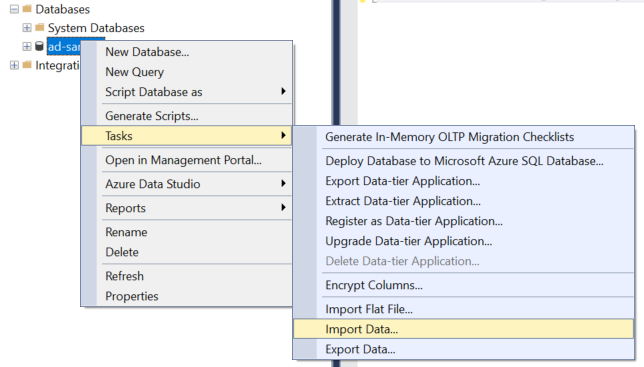
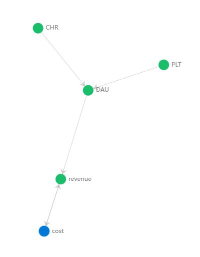

This page guides you to take use of the sample data and compose a quick demo and showcase the core capabilities of Azure Metrics Advisor service. 

# Step1 Create a Metrics Advisor resource
Create a Azure Metrics Advisor resource in [Azure portal](https://ms.portal.azure.com/#create/Microsoft.CognitiveServicesMetricsAdvisor). It may take about 20mins to create the resource successfully. 

During this period, you can get back to this repository and move to Step2 to prepare the sample data. 

# Step2 Prepare sample data
Download the sample data in 'Sample-data' folder. There're four files in total, please note to download all of them. After all the files are downloaded, you'll need to ingest the data into a database. Here we use SQL Server as an example. 

Open SQL Server management studio, choose one database where you'd like to put sample data. Right click on it and choose 'Tasks->Import data...' For further guidance, please refer to [Import data from Excel to SQL Server or Azure SQL Database](https://docs.microsoft.com/en-us/sql/relational-databases/import-export/import-data-from-excel-to-sql?view=sql-server-ver15).

| :exclamation: Remember to create one table for each sample file, eventually you need to have **four tables** created in your database!  |
|-----------------------------------------|



# Step3 create data feeds
After resource is created and sample data has been ingested to the database, go to [Metrics Advisor landing page](https://metricsadvisor.azurewebsites.net) to choose the workspace you just created and click 'Get started' to login. 

Choose 'Add data feed' and start to onboard the data into Metrics Advisor service. 

### Create data feed for Sample_CHR
Choose 'Import' button at top right, paste following configuration into the dialog, please **notice to replace some fields and use your own!!!**

```
{"datafeed":{"datafeedId":"","datafeedName":"Sample_CHR","createdTime":"","metrics":[{"metricId":"","metricName":"CHR","metricDisplayName":"Cache Hit Rate","metricDescription":"","metricType":"NORMAL","derivedScript":"","seriesCount":10}],"dimensions":[{"dimensionName":"region","dimensionDisplayName":"region"}],"dataStartFrom":"2022-4-20T01:00:00Z","dataSourceType":"SqlServer","parameterList":[{"name":"connectionString","value":"Data Source=**replace with your DB server**;Initial Catalog=**replace with your DB name**;User Id=**replace with your user Id**;Password=**replace with your password**;","requiredBy":["ServicePrincipal","ManagedIdentity","ServicePrincipalInKV","Basic"]},{"name":"query","value":"SELECT @StartTime as timestamp, CASE WHEN (GROUPING(region) = 1) THEN 'AVG' ELSE ISNULL(region, 'UNKNOWN') END as region, AVG(chr) as CHR FROM **replace with your table name of CHR metrics** WHERE timestamp = @IntervalStart GROUP BY CUBE(region)","requiredBy":null}],"timestampColumn":"timestamp","startOffsetInSeconds":0,"maxQueryPerMinute":30,"detectionStartTime":null,"granularityName":"Hourly","granularityAmount":null,"allUpIdentification":"AVG","needRollup":"RollupByUser","fillMissingPointForAd":"AutoFillValue","fillMissingPointForAdValue":0,"rollUpMethod":"None","extendedDimensions":null,"rollUpColumns":"","datafeedDescription":"","stopRetryAfterInSeconds":-1,"minRetryIntervalInSeconds":-1,"maxConcurrency":-1,"viewMode":"Private","admins":["**replace with your AAD credential(usually your email)**"],"viewers":[],"creator":"**replace with your AAD credential(usually your email)**","status":"Active","actionLinkTemplate":"","credentialUUID":null,"authenticationType":"Basic","enableAD":true,"enableIngestion":true,"maxDataRetention":-1,"isAdmin":true,"migrationType":0,"ingestionType":"Batch","datapointCount":63750},"delayAlertConfig":{"datafeedId":null,"gracePeriodInSeconds":null,"snoozeAlertCount":null,"hook":[],"configId":null,"alertType":null},"billingAccount":""}
```
Choose 'Apply' and 'Submit', then your data feed for CHR metric is onboarded successfully. It will take some time to get all the historical data ingested and process for detection resutls. You can move to create the next data feed.
| :exclamation: Please notice to replace values of following fields using your own!!! **'Data source', 'Initial catalog','user id', 'password', 'table name', 'admins','creator'**. |
|-----------------------------------------|

### Create data feed for Sample_PLT
Choose 'Import' button at top right, paste following configuration into the dialog, please **notice to replace some fields and use your own!!!**

```
{"datafeed":{"datafeedId":"","datafeedName":"Sample_PLT","createdTime":"","metrics":[{"metricId":"","metricName":"PLT","metricDisplayName":"Page Load Time","metricDescription":"","metricType":"NORMAL","derivedScript":"","seriesCount":10}],"dimensions":[{"dimensionName":"region","dimensionDisplayName":"region"}],"dataStartFrom":"2022-4-20T01:00:00Z","dataSourceType":"SqlServer","parameterList":[{"name":"connectionString","value":"Data Source=**replace with your DB server**;Initial Catalog=**replace with your DB name**;User Id=**replace with your user Id**;Password=**replace with your password**;","requiredBy":["ServicePrincipal","ManagedIdentity","ServicePrincipalInKV","Basic"]},{"name":"query","value":"SELECT @StartTime as timestamp, CASE WHEN (GROUPING(region) = 1) THEN 'AVG' ELSE ISNULL(region, 'UNKNOWN') END as region, AVG(plt) as PLT FROM **replace with your table name of PLT metrics** WHERE timestamp = @IntervalStart GROUP BY CUBE(region)","requiredBy":null}],"timestampColumn":"timestamp","startOffsetInSeconds":0,"maxQueryPerMinute":30,"detectionStartTime":null,"granularityName":"Hourly","granularityAmount":null,"allUpIdentification":"AVG","needRollup":"RollupByUser","fillMissingPointForAd":"AutoFillValue","fillMissingPointForAdValue":0,"rollUpMethod":"None","extendedDimensions":null,"rollUpColumns":"","datafeedDescription":"","stopRetryAfterInSeconds":-1,"minRetryIntervalInSeconds":-1,"maxConcurrency":-1,"viewMode":"Private","admins":["**replace with your AAD credential(usually your email)**"],"viewers":[],"creator":"**replace with your AAD credential(usually your email)**","status":"Active","actionLinkTemplate":"","credentialUUID":null,"authenticationType":"Basic","enableAD":true,"enableIngestion":true,"maxDataRetention":-1,"isAdmin":true,"migrationType":0,"ingestionType":"Batch","datapointCount":63750},"delayAlertConfig":{"datafeedId":null,"gracePeriodInSeconds":null,"snoozeAlertCount":null,"hook":[],"configId":null,"alertType":null},"billingAccount":""}
```
Choose 'Apply' and 'Submit', then your data feed for PLT metric is onboarded successfully. It will take some time to get all the historical data ingested and process for detection resutls. You can move to create the next data feed.
| :exclamation: Please notice to replace values of following fields using your own!!! **'Data source', 'Initial catalog','user id', 'password', 'table name', 'admins','creator'**. |
|-----------------------------------------|

### Create data feed for DAU
Choose 'Import' button at top right, paste following configuration into the dialog, please **notice to replace some fields and use your own!!!**

```
{"datafeed":{"datafeedId":"","datafeedName":"Sample_DAU","createdTime":"","metrics":[{"metricId":"","metricName":"DAU","metricDisplayName":"Daily Active Users","metricDescription":"","metricType":"NORMAL","derivedScript":"","seriesCount":10}],"dimensions":[{"dimensionName":"region","dimensionDisplayName":"region"}],"dataStartFrom":"2022-4-20T00:00:00Z","dataSourceType":"SqlServer","parameterList":[{"name":"connectionString","value":"Data Source=**replace with your DB server**;Initial Catalog=**replace with your DB name**;User Id=**replace with your user Id**;Password=**replace with your password**;","requiredBy":["ServicePrincipal","ManagedIdentity","ServicePrincipalInKV","Basic"]},{"name":"query","value":"SELECT @StartTime as timestamp, CASE WHEN (GROUPING(region) = 1) THEN 'SUM' ELSE ISNULL(region, 'UNKNOWN') END as region, SUM(dau) as DAU FROM **replace with your table name of DAU metrics** WHERE timestamp = @IntervalStart GROUP BY CUBE(region)","requiredBy":null}],"timestampColumn":"timestamp","startOffsetInSeconds":0,"maxQueryPerMinute":30,"detectionStartTime":null,"granularityName":"Daily","granularityAmount":null,"allUpIdentification":"SUM","needRollup":"RollupByUser","fillMissingPointForAd":"AutoFillValue","fillMissingPointForAdValue":0,"rollUpMethod":"None","extendedDimensions":null,"rollUpColumns":"","datafeedDescription":"","stopRetryAfterInSeconds":-1,"minRetryIntervalInSeconds":-1,"maxConcurrency":-1,"viewMode":"Private","admins":["**replace with your AAD credential(usually your email)**"],"viewers":[],"creator":"**replace with your AAD credential(usually your email)**","status":"Active","actionLinkTemplate":"","credentialUUID":null,"authenticationType":"Basic","enableAD":true,"enableIngestion":true,"maxDataRetention":-1,"isAdmin":true,"migrationType":0,"ingestionType":"Batch","datapointCount":63750},"delayAlertConfig":{"datafeedId":null,"gracePeriodInSeconds":null,"snoozeAlertCount":null,"hook":[],"configId":null,"alertType":null},"billingAccount":""}
```
Choose 'Apply' and 'Submit', then your data feed for DAU metric is onboarded successfully. It will take some time to get all the historical data ingested and process for detection results. You can move to create the next data feed.
| :exclamation: Please notice to replace values of following fields using your own!!! **'Data source', 'Initial catalog','user id', 'password', 'table name', 'admins','creator'**. |
|-----------------------------------------|

### Create data feed for Revenue/Cost
Choose 'Import' button at top right, paste following configuration into the dialog, please **notice to replace some fields and use your own!!!**

```
{"datafeed":{"datafeedId":"","datafeedName":"Sample_Revenue/Cost","createdTime":"","metrics":[{"metricId":"","metricName":"cost","metricDisplayName":"Cost","metricDescription":"","metricType":"NORMAL","derivedScript":"","seriesCount":88},{"metricId":"","metricName":"revenue","metricDisplayName":"Revenue","metricDescription":"","metricType":"NORMAL","derivedScript":"","seriesCount":88}],"dimensions":[{"dimensionName":"category","dimensionDisplayName":"category"},{"dimensionName":"region","dimensionDisplayName":"region"}],"dataStartFrom":"2022-4-20T00:00:00Z","dataSourceType":"SqlServer","parameterList":[{"name":"connectionString","value":"Data Source=**replace with your DB server**;Initial Catalog=**replace with your DB name**;User Id=**replace with your user Id**;Password=**replace with your password**;","requiredBy":["ServicePrincipalInKV","ManagedIdentity","ServicePrincipal","Basic"]},{"name":"query","value":"SELECT @StartTime as timestamp,CASE WHEN (GROUPING(region) = 1) THEN 'SUM' ELSE ISNULL(region, 'UNKNOWN') END as region, CASE WHEN (GROUPING(category) = 1) THEN 'SUM' ELSE ISNULL(category, 'UNKNOWN') END as category, SUM(revenue) as revenue, SUM(cost) as cost FROM **replace with your table name of Revenue/Cost metrics**WHERE timestamp = @IntervalStart GROUP BY CUBE(region, category)","requiredBy":null}],"timestampColumn":"timestamp","startOffsetInSeconds":0,"maxQueryPerMinute":30,"detectionStartTime":null,"granularityName":"Daily","granularityAmount":null,"allUpIdentification":"SUM","needRollup":"RollupByUser","fillMissingPointForAd":"AutoFillValue","fillMissingPointForAdValue":0,"rollUpMethod":"None","extendedDimensions":null,"rollUpColumns":"","datafeedDescription":"","stopRetryAfterInSeconds":-1,"minRetryIntervalInSeconds":-1,"maxConcurrency":-1,"viewMode":"Private","admins":["**replace with your AAD credential(usually your email)**"],"viewers":[],"creator":"**replace with your AAD credential(usually your email)**","status":"Active","actionLinkTemplate":"","credentialUUID":null,"authenticationType":"Basic","enableAD":true,"enableIngestion":true,"maxDataRetention":-1,"isAdmin":true,"migrationType":0,"ingestionType":"Batch","datapointCount":31152},"delayAlertConfig":{"datafeedId":"","gracePeriodInSeconds":0,"snoozeAlertCount":0,"hook":[]},"billingAccount":""}
```
Choose 'Apply' and 'Submit', then your data feed for Revenue/Cost metric is onboarded successfully. It will take some time to get all the historical data ingested and process for detection resutls. By completing above steps, you have successfully get all the data onboarded!
| :exclamation: Please notice to replace values of following fields using your own!!! **'Data source', 'Initial catalog','user id', 'password', 'table name', 'admins','creator'**. |
|-----------------------------------------|


# Step4 Configure metrics graph
Aside of performing anomaly detection on metrics, Metrics Advisor also provides raech capabilities on issue diagnostic whenever there're anomalies detected. It can help significantly reduce the time for pinpointing the root cause using AI technics and minimize customer impact. However, the diagnostic process may need some business context, 'Metrics Gragh' is the feature to embed business context into the service and facilitate automatic root cause analysis. 

To complete the full demo, you will need to create a graph like below. It's a quite simple experience, if you need any guidance, please refer to [Build a metrics graph](https://docs.microsoft.com/en-us/azure/applied-ai-services/metrics-advisor/how-tos/metrics-graph).



# Step5 View demo script and present the demo
The [demo script](Demo_script.md) is published in the repository as well, please go through that first and get familiar with the demo story. After checking all the metrics data is onboarded and having the latest detection results. Then you're ready to go!