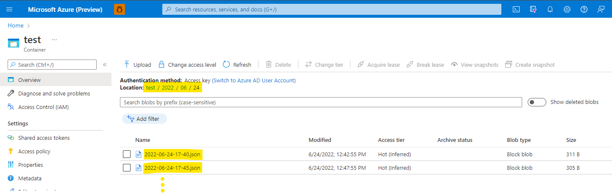

# Metrics Advisor
[Azure Metrics Advisor](https://azure.microsoft.com/en-us/services/metrics-advisor/#overview) is a time series monitoring platform that provides a set of APIs and a web-based workspace for ingesting time-series data, anomaly detection, sending alerts through multiple channels and diagnosing anomalous incidents without the need-to-know machine learning or write any code. For more information, please visit the [Azure Metrics Advisor technical documentation](https://docs.microsoft.com/en-us/azure/applied-ai-services/metrics-advisor/).

Metrics Advisor is designed for streaming data scenarios. This tutorial will help you create a Metrics Advisor resource and continuously stream the sample data into it via Azure blob storage. We will also show you how to set up the anomaly detection setting pipeline in Metrics Advisor step by step. Let's go! 

# Getting Started

## Step 1 - Create a Metrics Advisor resource
To get started, you need to create an Azure Metrics Advisor resource in your Azure resource group. To set up Metrics Advisor resource, navigate to your resource group in the [Azure portal](https://ms.portal.azure.com/), click `Create` to add a new resource, then select `Metrics Advisor`. Make sure the details are accurate, then create the resource. You can move to the next step while the resource is being created.

## Step 2 - Create a Blob Storage account

Next, you will need to add a storage account in your resource group to store the incoming messages. Within your resource group in the Azure portal, click `Create` and type `Storage account`. Make sure that the storage account is in the same region as your Metrics Advisor resource, and then click on `Review and create`. Next, navigate to your new storage account, click on the containers link on the left, and create a new storage container by clicking the `+ Container` and give it a name, and then click `Create`.

## Step 3 - Creating the virtual environment and installing the dependencies

Open a terminal, clone this repo to your local machine, then run the following commands to create and activate a new conda virtual environment and install the dependencies:
```bash
y | conda create --name metrics-advisor python=3.7
source activate metrics-advisor
pip install -r requirements.txt
```
Next, enter the following line in your terminal, replacing `<your-blob-connection-string>` with the blob connection string for your Azure blob storage account that you just created. You can find your connection string by navigating to your storage account in the Azure portal, and copying the `Connection string` from the "Access keys" section of the resource details.
```bash
export BLOB_CONNECTION_STRING="<your-blob-connection-string>"
```

## Step 4 - Run the script to stream data into Azure blob storage

The [stream2metricsadvisor.py](stream2metricsadvisor.py) script helps simulate streaming data into Azure Blob Storage (and therefore, Azure Metrics Advisor as well) in the absense of real sensor data streaming into your data store. This script accepts a CSV file and continuously loops over the data, processing the data from each timestamp at regular intervals, and pushes this data to blob storage. Once the data is in blob storage, you can use the [Azure Metrics Advisor web UI](https://metricsadvisor.azurewebsites.net) to create a data feed to ingest this streaming data and perform anomaly detection.

Please refer to the docstring inside the script for more details. You can use your own data instead of the sample CSV that we provide, but please modify the script if your data schema doesn't match the one we use.

To run this script, use the following command:
```bash
nohup python stream2metricsadvisor.py --csv_file=<path_to .csv> --container_name=<container_name> --minute_resample=5 > nohup.out 2>&1 &
```
Where `<path_to .csv>` points to your CSV file, and `<container_name>` is the name of the storage container you created in Step 2. When you enter the command above, the process will run the in background, and you will see the process id printed in the terminal. You can use the `ps` command to check the status of the process.

After you run the script, you can monitor its progress using the following command:
```bash
tail -f nohup.out
```
You can also check your sotrage container for a new JSON message to verify the script is running successfully. A new message will be uploaded every 5 minutes.



**Note**: Please give the script some time to stream enough data into blob storage to have enough historical data to run anomaly detection. You can come back after a few hours to complete the rest of the tutorial.

If you like to stop this script after you have completed this tutorial, you can kill the process by running `kill <pid>`, where `<pid>` is the process id of the Python script. 


## Step 5 - Create a data feed in Metrics Advisor

Now that we have data streaming to blob storage, go to the [Metrics Advisor landing page](https://metricsadvisor.azurewebsites.net), choose the workspace you just created and click **Get started** to login. 

Choose **Add data feed** to onboard the data to Metrics Advisor. Select `Azure Blob Storage (JSON)` as the data source, `Minutely` as the granularity, and set the date of the first message in blob storage in the `Ingest data since (UTC)` field.

Next, select `Basic` as your authentication type, paste your connection string into the `Connection string` field, and enter the name of the container you created in Step 2 into the `Container` field. Next, enter the following string in the `Blob template` field:
```
%Y/%m/%d/%Y-%m-%d-%h-%M.json
```
And type `v2` in the `JSON format version` field. The click `Load data`.


After you click **Load data**, you should choose the data schema same as below.


Finally, click `Verify schema`, give the datafeed a name, and click `Submit`.

## Step 6 - Configure your anomaly detection and alerting settings

Now that the data feed is created, we can create an optional alert hook if we want to receive alerts. To do so, click `Hooks` in the left navigation menu, and click `Create hook`.  You then follow the instructions in this [documentation page](https://docs.microsoft.com/en-us/azure/applied-ai-services/metrics-advisor/how-tos/alerts).


Now, let's click on the datafeed we have just created in the `Data feeds` section. We can click on one of the metrics like *methane_concentration* to see the ingested data so far, and set up an anomaly detection configuration. Please review this [documentation page](https://docs.microsoft.com/en-us/azure/applied-ai-services/metrics-advisor/how-tos/configure-metrics#tune-the-detection-configuration) for more details.


## Step 7 - Check the detected anomalies in Incident Hub

Once we have an anomaly detection configuration set up, we can explore the anomalies that have been detected viewing the **incidents** tab:


When you click one of the incident, you'll be led to **Incident Hub**, which allows you to see an overview of all the latest detected anomalies in real-time and see their severity scores. It also allows you to diagnose and analyze the root cause of each incident.


If you click one incident in the **Incident list**, you could see more detail of a specific incident.


## Step 8 - Explore the functionality of Metrics Advisor

Now that you know your way around Metrics Advisor, you can explore the different features that Metrics Advisor offers. Feel free to visit the documentation pages for more details, including [diagnosing an incident](https://docs.microsoft.com/en-us/azure/applied-ai-services/metrics-advisor/how-tos/diagnose-an-incident), [provide anomaly feedback](https://docs.microsoft.com/en-us/azure/applied-ai-services/metrics-advisor/how-tos/anomaly-feedback), and [build a metrics graph to analyze related metrics](https://docs.microsoft.com/en-us/azure/applied-ai-services/metrics-advisor/how-tos/metrics-graph). Finally, please see the additional resources below, and let us know if you have any questions or issues by opening an issue in this repository.


# Additional resources

📰 Read our blog post on [Detecting Methane Leaks using Azure Metrics Advisor](https://techcommunity.microsoft.com/t5/ai-cognitive-services-blog/detecting-methane-leaks-using-azure-metrics-advisor/ba-p/3254005)

👉 Join our community: [https://aka.ms/AnomalyDetector/Advisors](https://aka.ms/AnomalyDetector/Advisors)

🔗 Metrics Advisor Workspace: [https://metricsadvisor.azurewebsites.net/](https://metricsadvisor.azurewebsites.net/)

📑 Metrics Advisor documentation: [https://aka.ms/madoc](https://metricsadvisor.azurewebsites.net/)

